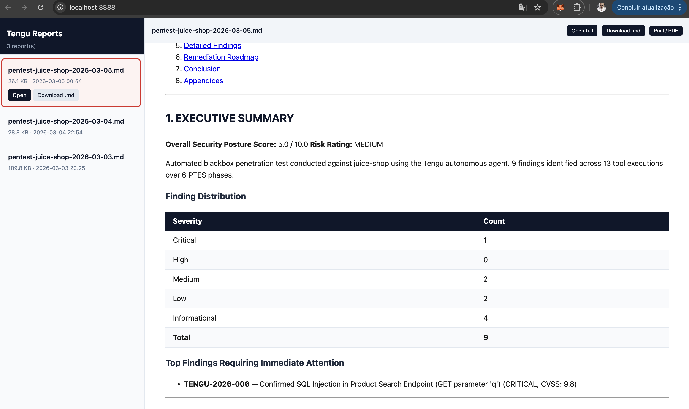

# Tengu — Pentesting MCP Server

<p align="center">
  
</p>

<p align="center">
  <em>"In Japanese mythology, the Tengu is a fierce mountain spirit — master strategist, warrior, and trainer of samurai. In cybersecurity, it guides you through every phase of the hunt."</em>
</p>

<p align="center">
  <strong>From recon to report — AI-assisted pentesting in one command.</strong>
</p>

<p align="center">
  <a href="https://github.com/rfunix/tengu/actions/workflows/ci.yml"></a>
  <a href="LICENSE"></a>
  <a href="https://python.org"></a>
  <a href="https://modelcontextprotocol.io"></a>
  
  
  
</p>

---

**Tengu** is an MCP server that turns Claude into a penetration testing copilot. It orchestrates 63 security tools — from Nmap to Metasploit — with built-in safety controls, audit logging, and professional reporting.

- **What is it?** An MCP server that connects Claude to industry-standard pentest tools
- **Why use it?** Automates recon and scanning while keeping the human in control of exploits
- **Who is it for?** Pentesters, red teamers, security students, and consulting firms

### Key Features

- **63 Tools** — Nmap, Metasploit, SQLMap, Nuclei, Hydra, Burp-compatible ZAP, and more
- **AI-Orchestrated** — Claude decides the next tool based on previous findings
- **Safety First** — Allowlist, rate limiting, audit logs, and human-in-the-loop for destructive actions
- **Auto Reports** — Correlate findings and generate professional pentest reports (MD/HTML/PDF)
- **34 Workflows** — Pre-built prompts for full pentest, web app, AD, cloud, and more
- **20 Resources** — Built-in OWASP Top 10, MITRE ATT&CK, PTES, and pentest checklists
- **Stealth Layer** — Optional Tor/SOCKS5 proxy routing, UA rotation, and timing jitter

---

## MCP Server Mode (Copilot)

Use Claude as an interactive pentest copilot — you direct the engagement, Claude picks the right tools and chains them together automatically.


### Quick Start

```bash
git clone https://github.com/rfunix/tengu.git && cd tengu
make docker-build
make docker-up
```

Connect Claude Code to the running server:

```bash
claude mcp add --transport sse tengu http://localhost:8000/sse
```

Then ask Claude: `Do a full pentest on http://192.168.1.100`

Claude chains tools automatically: `validate_target` → `whatweb` → `nmap` → `nikto` →
`nuclei` → `sqlmap` → `correlate_findings` → `generate_report`

### Docker Profiles

| Command | What it starts |
|---------|----------------|
| `make docker-up` | Tengu MCP server (`:8000`) |
| `make docker-lab` | + Juice Shop, DVWA (safe practice targets) |
| `make docker-pentest` | + Metasploit, OWASP ZAP (real-world targets) |
| `make docker-full` | + Metasploit, ZAP, and lab targets |

**Scan custom targets without editing files:**

```bash
TENGU_ALLOWED_HOSTS="192.168.1.0/24,10.0.0.0/8" make docker-up
```

### Image Tiers

Choose the right size for your use case:

| Tier | Size | MCP Tools | Use case |
|------|------|-----------|----------|
| `minimal` | ~480MB | 17 | Lightweight analysis, CVE research, reporting |
| `core` | ~7GB | 47 | Full pentest toolkit (default) |
| `full` | ~8GB | 63 | Everything + AD, wireless, stealth/OPSEC |

```bash
TENGU_TIER=minimal make docker-build   # lightweight
TENGU_TIER=core    make docker-build   # default
TENGU_TIER=full    make docker-build   # everything
```

> **All tiers include all 34 prompts and 20 resources** — only the binary tools differ.

<details>
<summary>Manual Install (without Docker)</summary>

**Prerequisites:** Python 3.12+, [`uv`](https://github.com/astral-sh/uv), Kali Linux (recommended)

```bash
git clone https://github.com/rfunix/tengu.git && cd tengu

# Install Python dependencies
uv sync

# Install external pentesting tools (Kali/Debian)
make install-tools

# Run the MCP server (stdio transport)
uv run tengu
```

Connect Claude Code:

```bash
claude mcp add --scope user tengu -- uv run --directory /path/to/tengu tengu
```

Configure allowed targets in `tengu.toml`:

```toml
[targets]
allowed_hosts = ["192.168.1.0/24", "example.com"]
```

For Claude Desktop, VM/SSE remote setup, and advanced configurations, see [docs/deployment-guide.md](docs/deployment-guide.md).

</details>

### Configuration Reference

```toml
[targets]
# REQUIRED: Only these hosts will be scanned
allowed_hosts = ["192.168.1.0/24", "example.com"]
blocked_hosts = []  # Always blocked, even if in allowed_hosts

[stealth]
enabled = false  # Route traffic through Tor/proxy

[stealth.proxy]
enabled = false
type = "socks5h"
host = "127.0.0.1"
port = 9050

[osint]
shodan_api_key = ""  # Required for shodan_lookup

[tools.defaults]
scan_timeout = 300   # seconds
```

See [docs/configuration-reference.md](docs/configuration-reference.md) for the full reference.

---

## Autonomous Agent Mode

Run a fully autonomous pentest without manual tool invocation. The agent uses Claude as its strategic brain and Tengu as its execution toolset, following the PTES methodology from recon through reporting.


### Quick Start

```bash
cp .env.example .env
# Edit .env: set ANTHROPIC_API_KEY and TENGU_AGENT_TARGET
```

**Lab targets (Juice Shop, DVWA):**

```bash
make docker-lab
make docker-agent          # default model (sonnet)
make docker-agent-haiku    # cheaper — claude-haiku-4-5, max_tokens=1024
make docker-agent-sonnet   # balanced — claude-sonnet-4-6, max_tokens=4096
```

**Real-world pentests (Tengu + MSF + ZAP, no lab containers):**

```bash
make docker-pentest
make docker-agent
```

**View reports in browser:**

```bash
make docker-report-view          # http://localhost:8888 — styled HTML, all reports
make docker-report-browse        # same, auto-opens browser
REPORT_PORT=9999 make docker-report-view   # custom port
```

<p align="center">
  
</p>

**Without Docker:**

```bash
uv sync --extra agent
python autonomous_tengu.py 192.168.1.100 --scope 192.168.1.0/24 --type blackbox

# Cost-optimised run
python autonomous_tengu.py 192.168.1.100 --model claude-haiku-4-5 --max-tokens 1024 --timeout 30
```

**Cost control** — three env vars / CLI flags:

| Flag | Env var | Default |
|---|---|---|
| `--model` | `TENGU_AGENT_MODEL` | `claude-sonnet-4-6` |
| `--max-tokens` | `TENGU_AGENT_MAX_TOKENS` | `2048` |
| `--timeout` | `TENGU_AGENT_TIMEOUT` | `60` (minutes, `0`=unlimited) |

### How It Works

```
START → initializer → strategist ─┬─→ executor → analyst ─┬─→ strategist (loop)
                                   │                        └─→ reporter → END
                                   ├─→ human_gate → executor
                                   └─→ reporter → END
```

**Key behaviors:**

- **Strategist** (Claude) reads the current PTES phase and accumulated state to decide each action
- **Executor** calls exactly one Tengu MCP tool per iteration
- **Analyst** (Claude) extracts structured data from tool output and advances phases
- **Human gate** interrupts execution before destructive tools (`msf_run_module`, `hydra_attack`, `impacket_kerberoast`, `sqlmap_scan` with level≥3)
- Runs until all 7 PTES phases are covered or `--max-iterations` is reached
- Final **Reporter** calls `correlate_findings` + `score_risk` + `generate_report`

### PTES Methodology — 7 Phases

| Phase | Name | What Tengu Does | Key Tools |
|:---:|---|---|---|
| 1 | Pre-Engagement | `validate_target` confirms scope, `check_tools` verifies readiness | `validate_target`, `check_tools` |
| 2 | Intelligence Gathering | OSINT, DNS recon, subdomain enumeration, technology fingerprinting | `nmap`, `subfinder`, `amass`, `shodan`, `whatweb` |
| 3 | Threat Modeling | Claude analyzes gathered intel, prioritizes attack surface, builds threat scenarios | *(AI-driven — no external tool)* |
| 4 | Vulnerability Analysis | Template scanning, web app testing, SSL/TLS analysis, parameter fuzzing | `nuclei`, `nikto`, `ffuf`, `sqlmap`, `testssl` |
| 5 | Exploitation | Controlled exploitation of confirmed vulnerabilities with human-in-the-loop | `msf_run_module`, `sqlmap`, `hydra`, `searchsploit` |
| 6 | Post-Exploitation | Credential harvesting, lateral movement assessment, privilege escalation | `impacket_kerberoast`, `nxc_enum`, `enum4linux` |
| 7 | Reporting | Correlate all findings, calculate risk scores, generate professional report | `correlate_findings`, `score_risk`, `generate_report` |

---

## Tool Catalog

> `minimal` (17 tools, ~480MB) · `core` (47 tools, ~7GB, default) · `full` (63 tools, ~8GB)
> Build with: `TENGU_TIER=<tier> make docker-build`. All tiers include all 34 prompts and 20 resources.

| Category | Tools | Count |
|----------|-------|-------|
| Reconnaissance | Nmap, Masscan, Amass, Subfinder, theHarvester, WhatWeb, Gowitness, HTTrack | 8 |
| Web Scanning | Nikto, Nuclei, FFUF, Gobuster, WPScan, Arjun, OWASP ZAP | 7 |
| SSL / TLS | sslyze, testssl.sh, HTTP headers analysis, CORS tester | 4 |
| DNS | DNS Enumerate, DNSRecon, Subjack, WHOIS | 4 |
| Injection Testing | SQLMap, Dalfox (XSS), GraphQL Security Check | 3 |
| Brute Force | Hydra, John the Ripper, Hashcat, CeWL | 4 |
| Exploitation | Metasploit (search, info, run, sessions, cmd), SearchSploit | 6 |
| Social Engineering | SET credential harvester, QR code attack, payload generator | 3 |
| OSINT | theHarvester, Shodan, WHOIS | 3 |
| Secrets & Code | TruffleHog, Gitleaks | 2 |
| Container & Cloud | Trivy, Checkov, ScoutSuite | 3 |
| Active Directory | NetExec, Enum4linux, Impacket Kerberoast | 3 |
| Wireless | aircrack-ng / airodump-ng | 1 |
| Anonymity & Stealth | Tor check/rotate, proxy check, identity rotation | 5 |
| Analysis & Reporting | Finding correlation, CVSS risk scoring, report generation | 3 |
| CVE Intelligence | CVE lookup (NVD), CVE search by keyword/product/severity | 2 |
| Utility | Tool checker, target validator | 2 |

<details>
<summary>Full tool list (63 tools)</summary>

### Reconnaissance
| Tool | Description |
|------|-------------|
| `nmap_scan` | Port scanning and service/OS detection |
| `masscan_scan` | High-speed port scanner for large networks |
| `subfinder_enum` | Passive subdomain enumeration |
| `amass_enum` | Attack surface mapping and DNS brute-force |
| `dnsrecon_scan` | DNS recon (zone transfer, brute-force, PTR) |
| `dns_enumerate` | DNS record enumeration (A, MX, NS, TXT, SOA…) |
| `whois_lookup` | WHOIS domain and IP lookup |
| `subjack_check` | Subdomain takeover detection |
| `gowitness_screenshot` | Web screenshot capture for documentation |
| `httrack_mirror` | Full website mirror for offline analysis and forensics |

### Web Scanning
| Tool | Description |
|------|-------------|
| `nuclei_scan` | Template-based vulnerability scanner (CVEs, misconfigs) |
| `nikto_scan` | Web server misconfiguration and outdated software scanner |
| `ffuf_fuzz` | Directory, parameter, and vhost fuzzing |
| `gobuster_scan` | Directory, DNS, and vhost brute-force |
| `wpscan_scan` | WordPress vulnerability scanner |
| `testssl_check` | Comprehensive SSL/TLS configuration analysis |
| `analyze_headers` | HTTP security headers analysis and grading |
| `test_cors` | CORS misconfiguration detection |
| `ssl_tls_check` | SSL/TLS certificate and cipher check (sslyze) |

### OSINT
| Tool | Description |
|------|-------------|
| `theharvester_scan` | Email, subdomain, and host enumeration from public sources |
| `shodan_lookup` | Shodan host and asset search |
| `whatweb_scan` | Web technology fingerprinting (CMS, WAF, frameworks) |

### Injection Testing
| Tool | Description |
|------|-------------|
| `sqlmap_scan` | Automated SQL injection detection and exploitation |
| `xss_scan` | XSS detection via Dalfox |
| `graphql_security_check` | GraphQL introspection, batching, depth limit, field suggestions |
| `arjun_discover` | Hidden HTTP parameter discovery |

### Exploitation
| Tool | Description |
|------|-------------|
| `msf_search` | Search Metasploit modules |
| `msf_module_info` | Get detailed Metasploit module information |
| `msf_run_module` | Execute a Metasploit module (requires explicit confirmation) |
| `msf_sessions_list` | List active Metasploit sessions |
| `msf_session_cmd` | Execute a command on an active session (shell/Meterpreter) |
| `searchsploit_query` | Search Exploit-DB offline database |

### Social Engineering
| Tool | Description |
|------|-------------|
| `set_credential_harvester` | Clone a website and capture submitted credentials (authorized phishing simulations) |
| `set_qrcode_attack` | Generate QR code pointing to a URL for physical social engineering assessments |
| `set_payload_generator` | Generate social engineering payloads (PowerShell, HTA) for authorized campaigns |

### Brute Force
| Tool | Description |
|------|-------------|
| `hydra_attack` | Network login brute-force (SSH, FTP, HTTP, SMB…) |
| `hash_crack` | Dictionary hash cracking (Hashcat / John the Ripper) |
| `hash_identify` | Hash type identification |
| `cewl_generate` | Custom wordlist generation from a target website |

### Proxy / DAST
| Tool | Description |
|------|-------------|
| `zap_spider` | OWASP ZAP web spider |
| `zap_active_scan` | OWASP ZAP active vulnerability scan |
| `zap_get_alerts` | Retrieve ZAP scan findings |

### Secrets & Code Analysis
| Tool | Description |
|------|-------------|
| `trufflehog_scan` | Leaked secrets detection in git repositories |
| `gitleaks_scan` | Credential scanning in git history |

### Container Security
| Tool | Description |
|------|-------------|
| `trivy_scan` | Vulnerability scanning for Docker images, IaC, and SBOM |

### Cloud Security
| Tool | Description |
|------|-------------|
| `scoutsuite_scan` | Cloud security audit (AWS, Azure, GCP) |

### Active Directory
| Tool | Description |
|------|-------------|
| `enum4linux_scan` | SMB/NetBIOS enumeration |
| `nxc_enum` | Active Directory enumeration via NetExec |
| `impacket_kerberoast` | Kerberoasting with Impacket GetUserSPNs |

### Wireless
| Tool | Description |
|------|-------------|
| `aircrack_scan` | Passive wireless network scan (airodump-ng) |

### IaC Security
| Tool | Description |
|------|-------------|
| `checkov_scan` | IaC misconfiguration scan (Terraform, K8s, Dockerfile) |

### Stealth / OPSEC
| Tool | Description |
|------|-------------|
| `tor_check` | Verify Tor connectivity and exit node IP |
| `tor_new_identity` | Request new Tor circuit (NEWNYM) |
| `check_anonymity` | Check exposed IP, DNS leaks, and anonymity level |
| `proxy_check` | Validate proxy latency, exit IP, and anonymity type |
| `rotate_identity` | Rotate Tor circuit and User-Agent simultaneously |

### Analysis & Utility
| Tool | Description |
|------|-------------|
| `check_tools` | Verify which external tools are installed |
| `validate_target` | Validate target against allowlist |
| `correlate_findings` | Correlate findings across multiple scans |
| `score_risk` | CVSS-based risk scoring |
| `cve_lookup` | CVE details from NVD (CVSS, CWE, affected products) |
| `cve_search` | Search CVEs by keyword, product, or severity |
| `generate_report` | Generate Markdown/HTML/PDF pentest report |

</details>

---

## Workflows & Prompts (34)

Pre-built workflow templates that guide Claude through complete engagements.

| Category | Prompts |
|----------|---------|
| **Pentest workflows** | `full_pentest`, `quick_recon`, `web_app_assessment` |
| **Vulnerability assessment** | `assess_injection`, `assess_access_control`, `assess_crypto`, `assess_misconfig` |
| **OSINT** | `osint_investigation` |
| **Reports** | `executive_report`, `technical_report`, `full_pentest_report`, `finding_detail`, `risk_matrix`, `remediation_plan`, `retest_report` |
| **Stealth/OPSEC** | `stealth_assessment`, `opsec_checklist` |
| **Specialized** | `ad_assessment`, `api_security_assessment`, `container_assessment`, `cloud_assessment`, `wireless_assessment`, `bug_bounty_workflow`, `compliance_assessment` |
| **Quick actions** | `explore_url`, `map_network`, `hunt_subdomains`, `find_vulns`, `find_secrets`, `go_stealth`, `crack_wifi`, `pwn_target`, `msf_exploit_workflow` |
| **Social Engineering** | `social_engineering_assessment` |

---

## Built-in Resources (20)

Static reference data loaded by Claude during engagements.

| URI | Content |
|-----|---------|
| `owasp://top10/2025` | OWASP Top 10:2025 full list |
| `owasp://top10/2025/{A01..A10}` | Per-category details + testing checklist |
| `owasp://api-security/top10` | OWASP API Security Top 10 (2023) |
| `owasp://api-security/top10/{API1..API10}` | Per-category details |
| `ptes://phases` | PTES 7-phase methodology overview |
| `ptes://phase/{1..7}` | Phase details (objectives, tools, deliverables) |
| `checklist://web-application` | Web app pentest checklist (OWASP Testing Guide) |
| `checklist://api` | API pentest checklist |
| `checklist://network` | Network infrastructure checklist |
| `mitre://attack/tactics` | MITRE ATT&CK Enterprise tactics + techniques |
| `mitre://attack/technique/{T1xxx}` | Technique detail by ID |
| `creds://defaults/{product}` | Default credentials database |
| `payloads://{type}` | Curated payload lists by type (xss, sqli, lfi, ssti, etc.) |
| `stealth://techniques` | Reference guide for operational security techniques |
| `stealth://proxy-guide` | Step-by-step proxy and Tor configuration guide |
| `tools://catalog` | Live tool availability status |
| `tools://{tool}/usage` | Usage guide for nmap, nuclei, sqlmap, metasploit, trivy, amass |
| `prompts://list` | List of all available prompts with descriptions |
| `prompts://category/{category}` | Prompts filtered by category |

---

## Architecture

```
┌─────────────┐     MCP      ┌─────────────────┐    subprocess    ┌─────────────────┐
│   Claude    │◄────────────►│     Tengu        │─────────────────►│  Nmap, SQLMap,  │
│  (Desktop / │  stdio/SSE   │   MCP Server     │  (never shell=T) │  Metasploit...  │
│   Code)     │              │                  │                  └─────────────────┘
└─────────────┘              └────────┬─────────┘
                                      │
                               Every tool call passes through:
                                      │
                             ┌────────▼─────────┐
                             │  Safety Pipeline  │
                             │                  │
                             │  1. sanitizer    │  ← strip metacharacters, validate format
                             │  2. allowlist    │  ← check target against tengu.toml
                             │  3. rate_limiter │  ← sliding window + concurrent slots
                             │  4. audit logger │  ← JSON log to ./logs/tengu-audit.log
                             └──────────────────┘
```

---

## Configuration Files

Tengu uses three configuration files. Editing the wrong one is the most common source
of confusion when switching between local and Docker workflows.

| File | When to use | What it controls |
|------|-------------|------------------|
| `tengu.toml` (root) | Running locally: `uv run tengu`, `uv run python autonomous_tengu.py` | MCP server config: `allowed_hosts`, tool paths, rate limits, stealth |
| `docker/tengu.toml` | Running via Docker: `make docker-up`, `make docker-agent` | Same settings as root, but pre-configured for Docker networking (`172.16.0.0/12`, service DNS aliases). Baked into the image at build time — **rebuild required** after changes (`make docker-rebuild-tengu`) |
| `.env` | Both local and Docker | Secrets and runtime vars: `ANTHROPIC_API_KEY`, `TENGU_AGENT_TARGET`, `TENGU_AGENT_MODEL`, `TENGU_AGENT_MAX_TOKENS`, etc. Read by `docker compose` and `load_dotenv()` |
| `.env.example` | Reference only | Template listing all available environment variables |

**Quick config for copilot mode (local):** edit `tengu.toml` at the project root —
add your target to `[targets] allowed_hosts`.

**Quick config for agent mode (Docker):** edit `docker/tengu.toml`, then run
`make docker-rebuild-tengu` before `make docker-agent`.

> **Common pitfall:** if scans fail with `TargetNotAllowedError` inside Docker, you
> probably edited `tengu.toml` (root) instead of `docker/tengu.toml`. Docker uses its
> own copy baked into the image. After editing, run `make docker-rebuild-tengu`.

---

## Safety by Design

Tengu is built as a **force multiplier for human pentesters**, not an autonomous attack tool.

| Control | Description |
|---------|-------------|
| **Target Allowlist** | Only pre-approved targets in `tengu.toml` are ever scanned |
| **Input Sanitization** | All inputs are validated against strict patterns before reaching any tool |
| **Rate Limiting** | Sliding window + concurrent slot limits prevent accidental DoS |
| **Audit Logging** | Every tool invocation logged to `./logs/tengu-audit.log` in JSON format |
| **Human-in-the-Loop** | `msf_run_module`, `hydra_attack`, and `impacket_kerberoast` require explicit confirmation |
| **No shell=True — ever** | All subprocess calls use `asyncio.create_subprocess_exec` |

---

## Development

```bash
make install-dev    # Install Python deps + dev extras
make test           # Run unit + security tests
make lint           # ruff check
make typecheck      # mypy strict
make check          # lint + typecheck
make coverage       # pytest --cov
make inspect        # Open MCP Inspector
make doctor         # Check which pentest tools are installed
```

Tengu has 1931+ tests covering unit logic, security (command injection, input validation), and integration scenarios. See [CLAUDE.md](CLAUDE.md) for the full contributor guide.

---

## Legal Notice

Tengu is designed for **authorized security testing only**. Only scan systems you own or have explicit written permission to test. Unauthorized scanning is illegal in most jurisdictions. The authors accept no liability for misuse.
