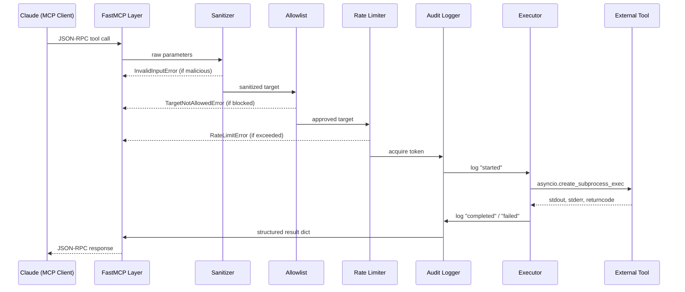
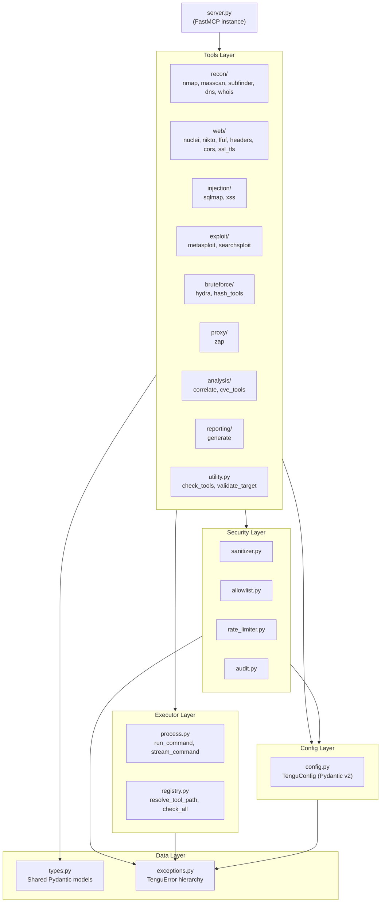
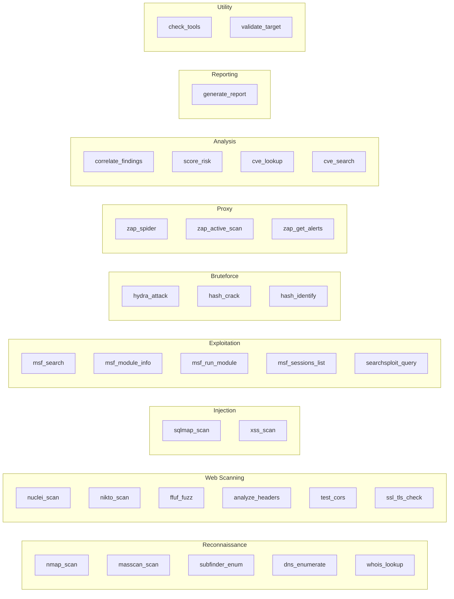

# Tengu Architecture

## System Overview

Tengu is a **Model Context Protocol (MCP) server** that acts as a secure intermediary
between an AI assistant (Claude) and industry-standard penetration testing tools.

The MCP protocol carries JSON-RPC 2.0 messages over stdio (or SSE for remote use).
Tengu implements three MCP primitives:

| Primitive | Count | Purpose |
|-----------|-------|---------|
| Tools     | 29    | Active operations: scanning, exploitation, analysis |
| Resources | 11    | Read-only reference data: OWASP, PTES, checklists |
| Prompts   | 14    | Guided workflow templates for complex engagements |

---

## Request Flow

Every tool invocation passes through a mandatory 5-layer security pipeline
before any external process is executed.

---

## Component Dependency Diagram

---

## Tool Categories and Coverage

---

## Design Decisions

### Why FastMCP?

FastMCP is the official Python SDK for building MCP servers. It provides:
- Automatic JSON-RPC serialization/deserialization
- Tool registration via simple function decoration (`mcp.tool()`)
- Resource registration via URI templates (`@mcp.resource("scheme://path/{param}")`)
- Prompt registration (`mcp.prompt()`)
- Progress reporting via `ctx.report_progress(current, total, message)`
- Both stdio and SSE transport support

The alternative — implementing the MCP protocol directly — would require thousands
of lines of boilerplate and introduce correctness risks in the protocol layer.

### Why No shell=True?

`shell=True` passes the command string to `/bin/sh -c`, which interprets shell
metacharacters. An attacker who can inject characters like `;`, `|`, `$()`, or
backticks into a parameter can execute arbitrary commands.

`asyncio.create_subprocess_exec()` passes arguments directly to `execve()` as an
argument vector. The kernel never invokes a shell, so shell metacharacters in
arguments have no special meaning. This is a complete class of vulnerability
eliminated by design.

Even though Tengu also sanitizes all inputs (defense in depth), the no-shell rule
is the primary and unconditional protection.

### Why Pydantic v2?

- Runtime validation of all configuration values on startup
- Automatic error messages for invalid config
- Type-safe model serialization/deserialization via `model_dump()` and `model_validate()`
- Field validators for complex constraints (e.g., ensuring `allowed_hosts` is always a list)
- Used consistently for all data structures: config, tool results, finding models

### Why structlog?

- Structured JSON log output — every log entry is machine-parseable
- Context binding (`logger.bind(target=x, tool=y)`) avoids repeating context in every call
- Compatible with the standard `logging` module for library compatibility
- The audit log is also JSONL — tools like `jq` can query it directly

### Why a Sliding Window Rate Limiter?

The sliding window algorithm (vs. fixed window) prevents burst-at-boundary attacks
where an attacker makes N calls at the end of window 1 and N more at the start of
window 2, effectively doubling the rate.

The in-memory implementation is intentional — Tengu is designed for single-server
deployments where Redis would be unnecessary overhead. If multi-server deployments
are needed, the `SlidingWindowRateLimiter` class can be replaced with a Redis-backed
implementation without changing any tool code.

### Why SQLite for CVE Cache?

- No additional infrastructure (no Redis, no PostgreSQL)
- Survives server restarts (unlike in-memory dict)
- Fast enough for lookup-heavy workloads (CVE IDs are primary keys)
- Simple to inspect and debug with standard SQLite tools
- 24-hour TTL prevents stale CVE data

---

## Module Map with Descriptions

| Module | Description |
|--------|-------------|
| `server.py` | FastMCP server instance. Imports and registers all tools, resources, and prompts. Contains the `main()` entry point. |
| `config.py` | Loads `tengu.toml` with `tomllib`, applies env var overrides, returns a `TenguConfig` singleton. Contains default blocked hosts list. |
| `types.py` | All shared Pydantic v2 models: network scan models (`Host`, `Port`, `ScanResult`), web models (`SecurityHeader`, `CORSResult`, `SSLResult`), finding models (`Finding`, `Evidence`), report models (`PentestReport`, `RiskMatrix`), CVE models (`CVERecord`, `CVSSMetrics`), tool status models (`ToolStatus`, `ToolsCheckResult`). |
| `exceptions.py` | Custom exception hierarchy rooted at `TenguError`. Each exception carries structured data (tool name, target, returncode, etc.) for programmatic handling. |
| `security/sanitizer.py` | Input validation functions for every parameter type. All functions raise `InvalidInputError` on invalid input. Never mutates input silently — either returns the sanitized value or raises. |
| `security/allowlist.py` | `TargetAllowlist` class with `check(target)` method. Supports CIDR, exact hostname, and wildcard patterns. Blocklist always evaluated before allowlist. |
| `security/rate_limiter.py` | `SlidingWindowRateLimiter` with per-tool call time tracking and concurrent slot counting. `rate_limited` is an async context manager for clean usage. |
| `security/audit.py` | `AuditLogger` writes append-only JSONL records to `logs/tengu-audit.log`. Async write with `asyncio.Lock` to prevent interleaving. `_redact_sensitive()` removes secrets before logging. |
| `executor/process.py` | `run_command()` — runs a command, returns `(stdout, stderr, returncode)`. `stream_command()` — async generator yielding output lines. Both use `asyncio.create_subprocess_exec`, never `shell=True`. |
| `executor/registry.py` | `check_all()` — discovers all tools in `_TOOL_CATALOG` and returns `ToolsCheckResult`. `resolve_tool_path()` — returns configured or auto-detected tool path. |
| `tools/utility.py` | `check_tools` and `validate_target` — the two utility MCP tools used to diagnose setup and pre-validate targets. |
| `tools/recon/nmap.py` | `nmap_scan` — the canonical reference tool implementation. Includes XML output parsing via `xml.etree.ElementTree`. |
| `tools/analysis/correlate.py` | `correlate_findings` — identifies attack chains by matching OWASP categories across findings. `score_risk` — CVSS-weighted risk scoring with context multipliers. |
| `tools/reporting/generate.py` | `generate_report` — Jinja2-based report rendering. Supports Markdown, HTML, and PDF (via WeasyPrint). |
| `resources/owasp.py` | OWASP Top 10:2025 data access. Data stored in `resources/data/owasp_top10_2025.json`. |
| `resources/ptes.py` | PTES 7-phase methodology data. Data stored in `resources/data/ptes_phases.json`. |
| `resources/checklists.py` | Web application, API, and network pentest checklists. |
| `prompts/pentest_workflow.py` | Workflow prompts: `full_pentest` (7 PTES phases), `quick_recon` (7-step fast recon), `web_app_assessment` (OWASP OTG). |
| `prompts/vuln_assessment.py` | Focused assessment prompts: injection, access control, cryptography, misconfiguration. |
| `prompts/report_prompts.py` | Report prompts: executive, technical, full, remediation plan, finding detail, risk matrix, retest. |
