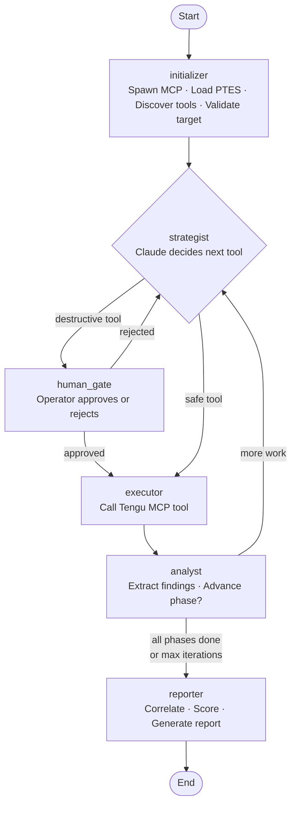
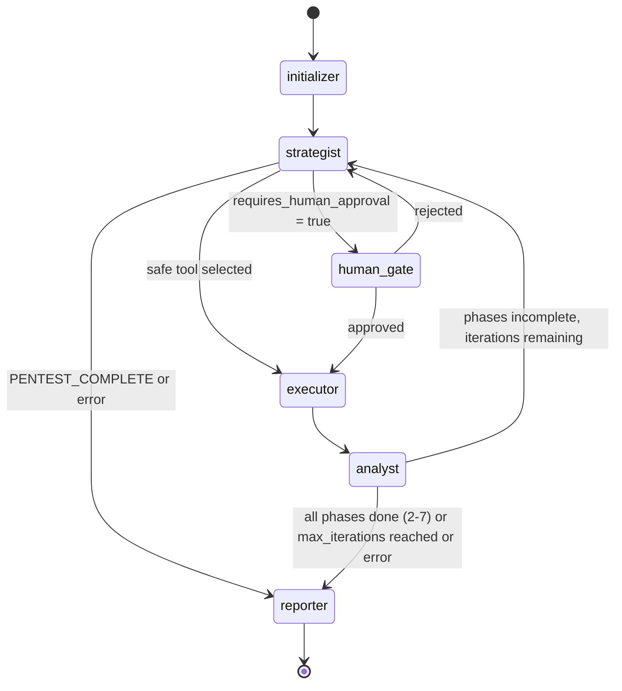
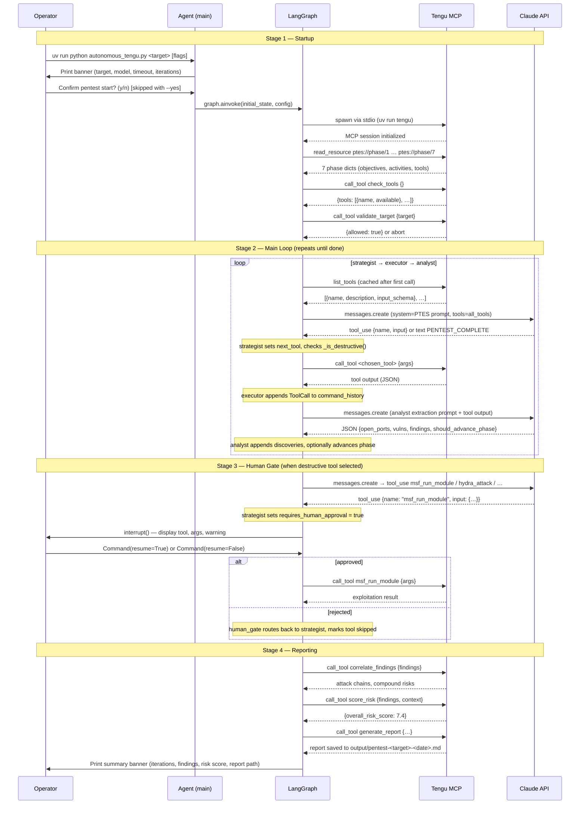

# Autonomous Pentest Agent

Tengu includes an optional autonomous agent (`autonomous_tengu.py`) that runs a full
penetration test with minimal human intervention — pausing only for destructive actions.
Point it at a target, it follows the PTES methodology across 7 phases, and at the end it
produces a complete markdown report. Three layers work together: **LangGraph** orchestrates
the flow, **Claude** reasons about what to do next, and **Tengu MCP** executes the actual
tools.

---

## How It Works

A complete engagement runs through six lifecycle stages:



**Startup** — `initializer` runs once: it spawns the Tengu MCP server via stdio, loads
all 7 PTES phase definitions (objectives, activities, recommended tools), discovers which
external binaries are actually installed, and validates the target against the allowlist.

**Decide** — `strategist` calls Claude via the Anthropic API. Claude receives the current
PTES phase objectives, the last five tool calls, and a snapshot of all discoveries. It
responds with a single tool call or `PENTEST_COMPLETE`.

**Gate** — if the chosen tool is destructive, `human_gate` pauses the graph via
LangGraph's `interrupt()` and waits for the operator to approve or reject.

**Act** — `executor` calls the tool through the Tengu MCP client and records the full
result in `command_history`.

**Learn** — `analyst` sends the raw output to Claude, which extracts structured
intelligence (ports, services, vulnerabilities, findings) and decides whether the current
PTES phase is now complete. If so, `current_phase` is incremented automatically.

**Report** — once all phases are covered (or the iteration limit is reached), `reporter`
calls `correlate_findings` → `score_risk` → `generate_report` and prints the summary banner.

---

## The Three Layers

| Layer | Technology | Responsibility |
|-------|-----------|----------------|
| **Orchestration** | LangGraph `StateGraph` | Controls flow — which node runs, when, and in what order |
| **Reasoning** | Claude (`claude-sonnet-4-6` by default, configurable) | Decides what to do next and extracts structured intelligence from tool output |
| **Execution** | Tengu MCP server (80 tools) | Runs the actual pentesting tools — Nmap, Nuclei, SQLMap, Metasploit, etc. |

Think of it this way: **LangGraph is the skeleton, Claude is the brain, Tengu is the hands.**

---

## The Graph — State Machine



The loop `strategist → executor → analyst → strategist` repeats until one of three
conditions is met:

- The strategist signals `PENTEST_COMPLETE`
- The analyst confirms all PTES phases 2–7 are satisfied
- The iteration counter reaches the configured maximum

---

## Nodes in Detail

### 5.1 Startup: `initializer`

Runs **exactly once** at the start of the engagement.

1. Spawns the Tengu MCP server as a subprocess (stdio transport via `uv run tengu`)
2. Loads all 7 PTES phase definitions from the `ptes://phase/{N}` MCP resources —
   each phase carries objectives, activities, and recommended tool names
3. Calls `check_tools` to discover which external binaries are actually installed on the
   system, so the strategist never proposes a tool that does not exist
4. Calls `validate_target` to confirm the target is in the Tengu allowlist; aborts with
   `is_complete = True` if it is not
5. Returns the initial engagement context (available tools, loaded phases, phase counter
   starting at 2) into the shared state

---

### 5.2 Decision Cycle: `strategist` → `executor` → `analyst`

**Decide, Act, Learn** — the core loop of the engagement.

#### `strategist` — Decide

The LLM brain of the agent. Builds a system prompt from the current PTES phase data,
the last `MAX_HISTORY_IN_PROMPT` (5) tool calls, and a snapshot of all discoveries.
Sends this to Claude via the Anthropic API with all available Tengu tools formatted as
native tool definitions.

Claude responds with either:
- A `tool_use` block — the tool name and its arguments
- Text containing `PENTEST_COMPLETE` — signals all objectives are satisfied

After parsing the response, the strategist checks whether the chosen tool is destructive
(`_is_destructive()`) and sets `requires_human_approval` accordingly.

#### `executor` — Act

The "dumb runner" — it does not interpret output.

Calls the MCP tool chosen by the strategist through the `TenguMCPClient`, measures
duration, and appends a `ToolCall` record to `command_history`. Because `command_history`
is typed as `Annotated[list[ToolCall], operator.add]`, each executor run **appends**
rather than replacing — the full call history accumulates across the engagement.
Also increments `iteration_count`.

#### `analyst` — Learn

The only node that populates discoveries and advances phases.

Sends the raw JSON output of the last tool call to Claude with a structured extraction
prompt. Claude returns a JSON object with up to seven fields:

| Field extracted | Maps to state field |
|-----------------|---------------------|
| `open_ports` | `open_ports` (append) |
| `services` | `services` (append) |
| `subdomains` | `subdomains` (append) |
| `technologies` | `technologies` (append) |
| `vulnerabilities` | `vulnerabilities` (append) |
| `findings` | `findings` (append) |
| `should_advance_phase` | increments `current_phase`, updates `phase_completed` |

When `should_advance_phase` is `true`, the analyst increments `current_phase` and marks
the old phase as complete in `phase_completed`. When all of phases 2–7 are marked
complete, the `should_continue` router sends execution to `reporter`.

---

### 5.3 Safety Gate: `human_gate`

Handles human-in-the-loop for dangerous operations.

Uses LangGraph's `interrupt()` primitive to **pause the graph** and surface the pending
action to the operator in a formatted approval prompt. The graph is frozen in memory
(via `MemorySaver`) until a `Command(resume=True/False)` is received from the caller.

- Approved → routes to `executor`
- Rejected → routes back to `strategist` with the tool marked as skipped

Tools that **always** require approval:

```python
DESTRUCTIVE_TOOLS = {
    "msf_run_module",
    "msf_session_cmd",
    "hydra_attack",
    "impacket_kerberoast",
}
```

`sqlmap_scan` is **conditionally destructive** — requires approval only when called with
`level >= 3` or `risk >= 2`.

> **Note:** `--yes` / `-y` skips the *initial confirmation prompt* at startup. It does
> **not** auto-approve destructive tools — those always pause for human input.

---

### 5.4 Finalization: `reporter`

Runs **once** at the end of the engagement. Calls three Tengu tools in sequence:

1. `correlate_findings` — identifies attack chains and compound risks across all findings
2. `score_risk` — calculates an overall CVSS-based risk score (0–10)
3. `generate_report` — produces a full markdown report saved to
   `output/pentest-{target}-{date}.md`

Prints the final summary banner with iteration count, open ports, finding breakdown, risk
score, and report path.

---

## Sequence Diagram

The diagram below shows the full temporal flow across all four stages of an engagement.



---

## Data Flow — How State Accumulates

Each node reads from and writes to the shared `PentestState`. The diagram below shows
which node is responsible for which fields.

```mermaid
flowchart LR
    subgraph initializer
        I1[ptes_phases]
        I2[available_tools]
        I3[current_phase]
        I4[phase_completed]
    end

    subgraph strategist
        S1[next_tool]
        S2[next_tool_args]
        S3[requires_human_approval]
        S4[human_decision]
        S5[is_complete]
    end

    subgraph executor
        E1[command_history ⊕]
        E2[iteration_count + 1]
        E3[requires_human_approval = false]
    end

    subgraph analyst
        A1[open_ports ⊕]
        A2[services ⊕]
        A3[subdomains ⊕]
        A4[technologies ⊕]
        A5[vulnerabilities ⊕]
        A6[findings ⊕]
        A7[current_phase + 1]
        A8[phase_completed]
    end

    subgraph reporter
        R1[is_complete = true]
    end

    initializer --> strategist --> executor --> analyst --> reporter
```



Fields marked **⊕** are typed as `Annotated[list, operator.add]` — LangGraph's state
reducer **appends** new entries rather than overwriting the list. This means discoveries
accumulate automatically across all iterations without any manual list management in node
code.

---

## Shared State Reference

All nodes read from and write to a single `PentestState` TypedDict. LangGraph merges
the dicts returned by each node into the shared state after every step.

| Field | Type | Written by | Description |
|-------|------|------------|-------------|
| `target` | `str` | caller | Target IP, hostname, or URL |
| `scope` | `list[str]` | caller | In-scope hosts/CIDRs |
| `engagement_type` | `str` | caller | `blackbox` \| `greybox` \| `whitebox` |
| `current_phase` | `int` | initializer, analyst | Current PTES phase (2–7) |
| `ptes_phases` | `list[dict]` | initializer | Full phase data loaded from `ptes://phase/{N}` |
| `phase_completed` | `dict[int, bool]` | analyst | Which phases have been marked complete |
| `open_ports` | `list[dict]` ⊕ | analyst | Accumulated open ports (auto-appended) |
| `services` | `list[dict]` ⊕ | analyst | Accumulated service banners (auto-appended) |
| `subdomains` | `list[str]` ⊕ | analyst | Accumulated subdomains (auto-appended) |
| `technologies` | `list[str]` ⊕ | analyst | Accumulated technology fingerprints (auto-appended) |
| `vulnerabilities` | `list[dict]` ⊕ | analyst | Accumulated vulnerabilities (auto-appended) |
| `findings` | `list[dict]` ⊕ | analyst | Accumulated general findings (auto-appended) |
| `available_tools` | `list[str]` | initializer | Tool names confirmed installed by `check_tools` |
| `command_history` | `list[ToolCall]` ⊕ | executor | Every tool call with args, result, duration (auto-appended) |
| `next_tool` | `str` | strategist | Tool chosen for the next step |
| `next_tool_args` | `dict` | strategist | Arguments for `next_tool` |
| `requires_human_approval` | `bool` | strategist, human_gate | Whether the next tool needs operator sign-off |
| `human_decision` | `str \| None` | human_gate | `"rejected"` after a denial, else `None` |
| `model` | `str` | caller | Claude model ID used by strategist and analyst |
| `max_tokens` | `int` | caller | Max tokens per API call |
| `is_complete` | `bool` | strategist, reporter | Signals all nodes to route toward the reporter |
| `error` | `str \| None` | initializer, strategist | Non-None causes immediate routing to reporter |
| `max_iterations` | `int` | caller | Maximum tool calls before forcing a report |
| `iteration_count` | `int` | executor | Number of tool calls executed so far |

---

## Configuration

For which config file to edit in each scenario (local vs Docker vs environment variables),
see the [Configuration Files](../README.md#configuration-files) section in the README.

Agent-specific configuration via CLI flags and environment variables is documented in
the [CLI Reference](#running-the-agent--cli-reference) section below.

---

## API Retry with Backoff

Both `strategist` and `analyst` call the Anthropic API through `_call_api_with_retry()`.
This wrapper handles transient overload gracefully:

- Retries on HTTP **429** (rate limit) and **529** (API overloaded)
- Exponential backoff: **5s → 10s → 20s → 40s → 80s**
- Maximum **5 attempts** before propagating the error
- Prints a progress line for each retry so operators can see what is happening

```python
_API_MAX_RETRIES = 5
_API_RETRY_BASE_DELAY = 5.0  # seconds; doubles each attempt
```

---

## Memory and Checkpointing

The graph is compiled with `MemorySaver`:

```python
graph = build_graph().compile(checkpointer=MemorySaver())
```

`MemorySaver` stores checkpoints **in RAM only**. This gives one benefit:

**Human-in-the-loop interrupts** — the graph state is checkpointed before `interrupt()`
pauses execution, so it can be resumed exactly where it left off after the operator
approves or rejects a destructive action.

> **Important:** `MemorySaver` is **not** crash recovery. If the Python process exits,
> all state is lost and the engagement cannot be resumed. It only enables pause/resume
> within a single running process.

---

## Running the Agent — CLI Reference

```bash
# Basic blackbox pentest
uv run python autonomous_tengu.py 192.168.1.100

# With explicit scope and engagement type
uv run python autonomous_tengu.py juice-shop \
    --scope 172.20.0.0/24 \
    --type greybox

# Limit iterations (default: 50)
uv run python autonomous_tengu.py 10.0.0.1 --max-iterations 30

# Non-interactive / Docker (skip startup prompt)
uv run python autonomous_tengu.py 10.0.0.1 --yes

# Cost-optimised run (cheaper model, lower token cap, 15-minute hard stop)
uv run python autonomous_tengu.py 10.0.0.1 \
    --model claude-haiku-4-5 \
    --max-tokens 1024 \
    --timeout 15
```

### CLI Flags

| Flag | Short | Default | Description |
|------|-------|---------|-------------|
| `target` | *(positional)* | required | Target IP, hostname, or URL |
| `--scope HOST …` | | `[target]` | In-scope hosts/CIDRs; multiple values allowed |
| `--type` | | `blackbox` | Engagement type: `blackbox`, `greybox`, `whitebox` |
| `--max-iterations N` | | `50` | Max tool calls before forcing the final report |
| `--model ID` | | `claude-sonnet-4-6` | Claude model for strategist and analyst |
| `--max-tokens N` | | `2048` | Max tokens per API call |
| `--timeout MINUTES` | | `60` | Total runtime limit in minutes; `0` = unlimited |
| `--yes` | `-y` | false | Skip the interactive startup confirmation prompt |

> `--yes` is required for non-interactive environments (Docker, CI). It **does not**
> auto-approve destructive tools — those always pause for human input.

### Requirements

- `ANTHROPIC_API_KEY` set in environment or `.env` file
- Tengu server runnable via `uv run tengu` (the agent spawns it automatically)
- Target present in `tengu.toml` `[targets].allowed_hosts`

---

## Cost Control

Three parameters let you tune the cost/capability trade-off:

| CLI flag | Env var | Default | Effect |
|---|---|---|---|
| `--model` | `TENGU_AGENT_MODEL` | `claude-sonnet-4-6` | Claude model for strategist and analyst |
| `--max-tokens` | `TENGU_AGENT_MAX_TOKENS` | `2048` | Max tokens per API call |
| `--timeout` | `TENGU_AGENT_TIMEOUT` | `60` | Total runtime limit in minutes (`0` = unlimited) |

Via Docker / Make:

```bash
# Cheap and fast
make docker-agent-haiku   # claude-haiku-4-5, max_tokens=1024

# Default (balanced)
make docker-agent-sonnet  # claude-sonnet-4-6, max_tokens=4096
```

Or override ad-hoc:

```bash
TENGU_AGENT_MODEL=claude-haiku-4-5 TENGU_AGENT_TIMEOUT=30 make docker-agent
```

---

## PTES Phase Mapping

The agent works through 6 active phases (phase 1, Pre-Engagement, is handled by the
operator before the agent starts):

| Phase | Name | What the agent does | Key tools |
|-------|------|---------------------|-----------|
| 2 | Intelligence Gathering | OSINT, DNS enumeration, subdomain discovery, WHOIS, technology fingerprinting | `subfinder`, `amass`, `nmap`, `shodan`, `theharvester` |
| 3 | Threat Modeling | Analyzes gathered data; identifies critical assets and attack surface; prioritizes attack scenarios | *(analysis — no active scanning)* |
| 4 | Vulnerability Analysis | Automated scanning, service enumeration, web app scanning, CVE research | `nuclei`, `nikto`, `nmap`, `sqlmap`, `testssl` |
| 5 | Exploitation | Confirms exploitability; web app attacks (SQLi, XSS, RCE); credential attacks | `metasploit`, `sqlmap`, `hydra`, `searchsploit` |
| 6 | Post-Exploitation | Privilege escalation, lateral movement, credential harvesting, persistence analysis | `metasploit`, `bloodhound`, `impacket_*` |
| 7 | Reporting | `correlate_findings` → `score_risk` → `generate_report` → summary banner | `correlate_findings`, `score_risk`, `generate_report` |

The `analyst` node advances phases automatically based on Claude's assessment of whether
the current phase objectives are satisfied. The strategist's system prompt always
specifies the current phase objectives so Claude focuses its tool selection accordingly.

---

## Why LangGraph Instead of a Simple Loop

A plain `while True` loop would work for the happy path, but LangGraph provides three
things that are difficult to replicate cleanly:

1. **Interrupt and resume** — `interrupt()` freezes the entire graph state and lets
   external code inject a decision before continuing. Implementing this correctly with a
   raw loop requires significant bookkeeping.

2. **Conditional routing** — edges between nodes can be functions, making the control
   flow explicit, testable, and easy to extend with new nodes.

3. **State reducers** — `Annotated[list, operator.add]` fields accumulate data across
   many iterations without any manual list management in node code.
